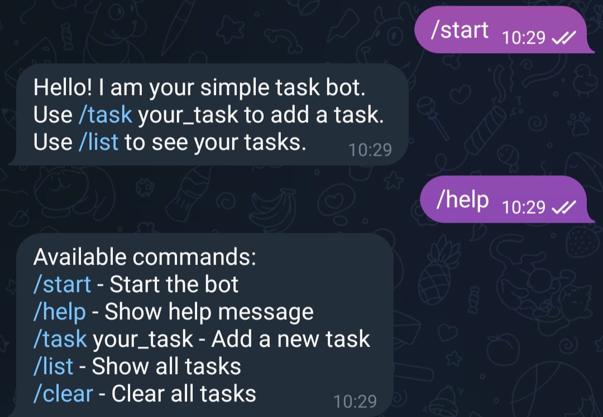
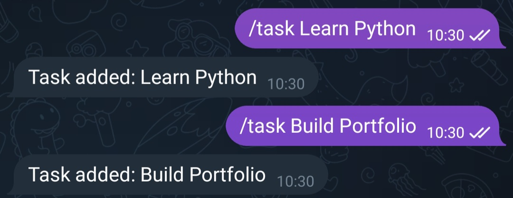
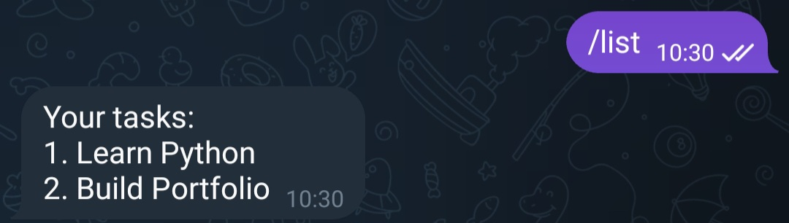

# Telegram Task Bot

A simple Telegram bot built with Python that allows users to manage tasks directly inside Telegram.

---

## Features

- Start command
- Help command
- Add tasks
- List saved tasks
- Clear all tasks
- Error handling
- Environment variable support with `.env`
- Logging support

---

## Technologies Used

- Python
- python-telegram-bot
- python-dotenv
- Git
- GitHub

---

## Project Structure

```text
telegram-task-bot/
├── screenshots/
│   ├── bot-start.png
│   ├── add-task.png
│   └── list-task.png
├── main.py
├── requirements.txt
├── README.md
├── .env
└── .gitignore
```

---

## Installation

Clone the repository:

```bash
git clone https://github.com/najafi81/telegram-task-bot.git
```

Go to project directory:

```bash
cd telegram-task-bot
```

Create virtual environment:

```bash
python3 -m venv venv
```

Activate virtual environment:

### Linux / macOS

```bash
source venv/bin/activate
```

Install dependencies:

```bash
pip install -r requirements.txt
```

---

## Environment Variables

Create a `.env` file and add your Telegram bot token:

```env
BOT_TOKEN=your_bot_token_here
```

---

## Usage

Run the bot:

```bash
python3 main.py
```

The bot will start polling Telegram updates.

---

## Available Commands

| Command | Description |
|---|---|
| `/start` | Start the bot |
| `/help` | Show help message |
| `/task <text>` | Add a new task |
| `/list` | Show saved tasks |
| `/clear` | Clear all tasks |

---

## Screenshots

### Bot Start



### Add Task



### Task List



---

## Example

```text
/task Learn Python
/task Build Telegram Bot
/list
```

Output:

```text
1. Learn Python
2. Build Telegram Bot
```

---

## Future Improvements

- Persistent database storage
- User authentication
- Task deadlines
- Docker support
- Deployment to cloud server
- Webhook support

---

## Author

Meisam Najafi

GitHub:
https://github.com/najafi81
